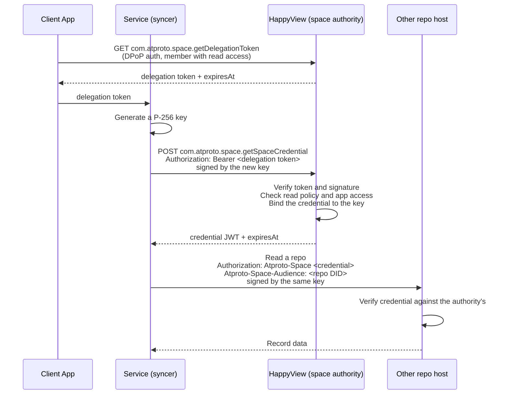

<Callout type="error" title="Experimental">
This API is experimental and will change. See the [Permissioned Spaces overview](../spaces.md) for context.
</Callout>

Space credentials are short-lived JWTs that let a service read a whole space without holding a member's OAuth session. A syncer, feed generator, or other repo host uses one to read the space's records from HappyView or from any other host that serves repos in the space.

Each credential is bound to a P-256 key held by the service that requested it. Every request made with the credential carries an [RFC 9421](https://www.rfc-editor.org/rfc/rfc9421) HTTP Message Signature by that key. A credential copied without its key is useless, so a host that receives one to serve its own repo cannot replay it against other hosts in the space.

## How credentials work

A member's consent comes from a **delegation token**, a 60-second JWT naming the member and the space. The service exchanges the delegation token for a **space credential**, proving possession of its key in the same request. The credential lasts 10 minutes.



Credentials for spaces whose authority is HappyView's instance DID are ES256 JWTs signed with the instance's `#atproto_space` key, which HappyView publishes in its DID document. Other hosts verify them against that key. Spaces anchored on their creator's DID (see [Space authority](./managing-spaces.md#space-authority)) sign with a per-space P-256 key that only HappyView holds, so only HappyView can verify their credentials.

## Step 1: Get a delegation token

A delegation token can come from two places:

- **HappyView**, through `com.atproto.space.getDelegationToken`. The caller must be authenticated as a member with read access. Members limited to their own records cannot obtain one.
- **The member's PDS**, when it serves spaces. The PDS signs the token with the account's own key. HappyView verifies it against the account's DID document.

Either way, the token's `aud` must be the space authority's `#atproto_space_host` (or `#atproto_pds`) service, and its `sub` must be the space URI.

```ts tab="TypeScript" tab-group="language"
const params = new URLSearchParams({
  space: "at://did:web:happyview.example.com/space/com.example.forum/main",
});
const response = await fetch(`https://happyview.example.com/xrpc/com.atproto.space.getDelegationToken?${params}`, {
  headers: {
    "X-Client-Key": CLIENT_KEY,
    "Authorization": `DPoP ${ACCESS_TOKEN}`,
    "DPoP": DPOP_PROOF,
  },
});
interface DelegationTokenResponse {
  delegationToken: string;
  expiresAt: string;
}
const data: DelegationTokenResponse = await response.json();
```
```js tab="JavaScript" tab-group="language"
const params = new URLSearchParams({
  space: "at://did:web:happyview.example.com/space/com.example.forum/main",
});
const response = await fetch(`https://happyview.example.com/xrpc/com.atproto.space.getDelegationToken?${params}`, {
  headers: {
    "X-Client-Key": CLIENT_KEY,
    "Authorization": `DPoP ${ACCESS_TOKEN}`,
    "DPoP": DPOP_PROOF,
  },
});
const data = await response.json();
```
```rust tab="Rust" tab-group="language"
let response = client
    .get("https://happyview.example.com/xrpc/com.atproto.space.getDelegationToken")
    .query(&[("space", "at://did:web:happyview.example.com/space/com.example.forum/main")])
    .header("X-Client-Key", client_key)
    .header("Authorization", format!("DPoP {}", access_token))
    .header("DPoP", &dpop_proof)
    .send()
    .await?;
let data: serde_json::Value = response.json().await?;
```
```go tab="Go" tab-group="language"
req, _ := http.NewRequest("GET",
  "https://happyview.example.com/xrpc/com.atproto.space.getDelegationToken?space=at%3A%2F%2Fdid%3Aweb%3Ahappyview.example.com%2Fspace%2Fcom.example.forum%2Fmain",
  nil)
req.Header.Set("X-Client-Key", clientKey)
req.Header.Set("Authorization", "DPoP "+accessToken)
req.Header.Set("DPoP", dpopProof)
resp, err := http.DefaultClient.Do(req)
```
```sh tab="cURL" tab-group="language"
curl 'https://happyview.example.com/xrpc/com.atproto.space.getDelegationToken?space=at%3A%2F%2Fdid%3Aweb%3Ahappyview.example.com%2Fspace%2Fcom.example.forum%2Fmain' \
  -H 'X-Client-Key: hvc_...' \
  -H 'Authorization: DPoP <token>' \
  -H 'DPoP: <proof>'
```

**Response:**

```json
{
  "delegationToken": "eyJhbGciOiJFUzI1NksiLCJ0eXAiOiJhdHByb3RvLXNwYWNlLWRlbGVnYXRpb24rand0In0...",
  "expiresAt": "2026-09-30T12:01:00Z"
}
```

The OAuth session must hold a `space:` scope with the full `read` action for the space. See [OAuth scopes](./managing-spaces.md#oauth-scopes).

`dev.happyview.space.getMemberGrant` is a deprecated alias of this endpoint, kept until v3.

## Signing requests

Exchanging a delegation token and using a credential both require an `atproto-space` HTTP Message Signature. The signing key is a P-256 key, identified by its `did:key`. The service generates the key and keeps it for as long as it uses the credential.

The signature covers the `Authorization` field and, when a credential is used, the `Atproto-Space-Audience` field. The signature base is those fields followed by the signature parameters, one per line, with no trailing newline:

```
"authorization": Atproto-Space eyJhbGciOiJFUzI1NiIsInR5cCI6ImF0cHJvdG8tc3BhY2UtY3JlZGVudGlhbCtqd3QifQ...
"atproto-space-audience": did:plc:author456
"@signature-params": ("authorization" "atproto-space-audience")
```

The signature is ECDSA P-256 over SHA-256 of the base, encoded as the raw 64-byte `r || s` value (not DER). The request carries two more fields:

```
Signature-Input: atproto-space=("authorization" "atproto-space-audience")
Signature: atproto-space=:<standard base64 of the 64-byte signature>:
```

The parameters are:

| Parameter | Delegation token exchange | Credential use |
| --- | --- | --- |
| Covered fields | `("authorization")` | `("authorization" "atproto-space-audience")`, in that order |
| `keyid` | Required: the key's `did:key` | Optional. When present, it must match the credential's `cnf.kid` |
| `alg` | Optional. When present, it must be `ecdsa-p256-sha256` | Same |

Other labels in `Signature-Input` and `Signature` are ignored. A missing, malformed, or invalid signature fails with `401 BadSpaceSignature`.

The helpers below produce the three fields. The cURL tab shows the fields a request carries.

```ts tab="TypeScript" tab-group="language"
import { base58 } from "@scure/base";

const keyPair = await crypto.subtle.generateKey(
  { name: "ECDSA", namedCurve: "P-256" },
  false,
  ["sign", "verify"],
);

async function didKey(publicKey: CryptoKey): Promise<string> {
  const raw = new Uint8Array(await crypto.subtle.exportKey("raw", publicKey));
  const compressed = new Uint8Array(33);
  compressed[0] = raw[64] & 1 ? 0x03 : 0x02;
  compressed.set(raw.slice(1, 33), 1);
  return `did:key:z${base58.encode(new Uint8Array([0x80, 0x24, ...compressed]))}`;
}

async function signSpaceRequest(
  authorization: string,
  audience?: string,
): Promise<Record<string, string>> {
  const params = audience
    ? `("authorization" "atproto-space-audience")`
    : `("authorization");keyid="${await didKey(keyPair.publicKey)}"`;
  const lines = [`"authorization": ${authorization}`];
  if (audience) lines.push(`"atproto-space-audience": ${audience}`);
  lines.push(`"@signature-params": ${params}`);

  const signature = new Uint8Array(
    await crypto.subtle.sign(
      { name: "ECDSA", hash: "SHA-256" },
      keyPair.privateKey,
      new TextEncoder().encode(lines.join("\n")),
    ),
  );
  const headers: Record<string, string> = {
    "Authorization": authorization,
    "Signature-Input": `atproto-space=${params}`,
    "Signature": `atproto-space=:${btoa(String.fromCharCode(...signature))}:`,
  };
  if (audience) headers["Atproto-Space-Audience"] = audience;
  return headers;
}
```
```js tab="JavaScript" tab-group="language"
import { base58 } from "@scure/base";

const keyPair = await crypto.subtle.generateKey(
  { name: "ECDSA", namedCurve: "P-256" },
  false,
  ["sign", "verify"],
);

async function didKey(publicKey) {
  const raw = new Uint8Array(await crypto.subtle.exportKey("raw", publicKey));
  const compressed = new Uint8Array(33);
  compressed[0] = raw[64] & 1 ? 0x03 : 0x02;
  compressed.set(raw.slice(1, 33), 1);
  return `did:key:z${base58.encode(new Uint8Array([0x80, 0x24, ...compressed]))}`;
}

async function signSpaceRequest(authorization, audience) {
  const params = audience
    ? `("authorization" "atproto-space-audience")`
    : `("authorization");keyid="${await didKey(keyPair.publicKey)}"`;
  const lines = [`"authorization": ${authorization}`];
  if (audience) lines.push(`"atproto-space-audience": ${audience}`);
  lines.push(`"@signature-params": ${params}`);

  const signature = new Uint8Array(
    await crypto.subtle.sign(
      { name: "ECDSA", hash: "SHA-256" },
      keyPair.privateKey,
      new TextEncoder().encode(lines.join("\n")),
    ),
  );
  const headers = {
    "Authorization": authorization,
    "Signature-Input": `atproto-space=${params}`,
    "Signature": `atproto-space=:${btoa(String.fromCharCode(...signature))}:`,
  };
  if (audience) headers["Atproto-Space-Audience"] = audience;
  return headers;
}
```
```rust tab="Rust" tab-group="language"
use base64::{engine::general_purpose::STANDARD, Engine};
use p256::ecdsa::{signature::Signer, Signature, SigningKey};
use reqwest::header::HeaderMap;

let signing_key = SigningKey::random(&mut rand::rngs::OsRng);

fn did_key(key: &SigningKey) -> String {
    let mut bytes = vec![0x80, 0x24];
    bytes.extend_from_slice(key.verifying_key().to_encoded_point(true).as_bytes());
    format!("did:key:z{}", bs58::encode(bytes).into_string())
}

fn sign_space_request(key: &SigningKey, authorization: &str, audience: Option<&str>) -> HeaderMap {
    let params = match audience {
        Some(_) => r#"("authorization" "atproto-space-audience")"#.to_string(),
        None => format!(r#"("authorization");keyid="{}""#, did_key(key)),
    };
    let mut lines = vec![format!("\"authorization\": {authorization}")];
    if let Some(audience) = audience {
        lines.push(format!("\"atproto-space-audience\": {audience}"));
    }
    lines.push(format!("\"@signature-params\": {params}"));

    let signature: Signature = key.sign(lines.join("\n").as_bytes());
    let mut headers = HeaderMap::new();
    headers.insert("authorization", authorization.parse().unwrap());
    if let Some(audience) = audience {
        headers.insert("atproto-space-audience", audience.parse().unwrap());
    }
    headers.insert("signature-input", format!("atproto-space={params}").parse().unwrap());
    headers.insert(
        "signature",
        format!("atproto-space=:{}:", STANDARD.encode(signature.to_bytes())).parse().unwrap(),
    );
    headers
}
```
```go tab="Go" tab-group="language"
import (
  "crypto/ecdsa"
  "crypto/elliptic"
  "crypto/rand"
  "crypto/sha256"
  "encoding/base64"
  "fmt"
  "net/http"
  "strings"

  "github.com/mr-tron/base58"
)

var key, _ = ecdsa.GenerateKey(elliptic.P256(), rand.Reader)

func didKey(key *ecdsa.PrivateKey) string {
  point := elliptic.MarshalCompressed(elliptic.P256(), key.X, key.Y)
  return "did:key:z" + base58.Encode(append([]byte{0x80, 0x24}, point...))
}

func signSpaceRequest(req *http.Request, key *ecdsa.PrivateKey, authorization, audience string) {
  params := fmt.Sprintf(`("authorization");keyid="%s"`, didKey(key))
  lines := []string{`"authorization": ` + authorization}
  if audience != "" {
    params = `("authorization" "atproto-space-audience")`
    lines = append(lines, `"atproto-space-audience": `+audience)
    req.Header.Set("Atproto-Space-Audience", audience)
  }
  lines = append(lines, `"@signature-params": `+params)

  digest := sha256.Sum256([]byte(strings.Join(lines, "\n")))
  r, s, _ := ecdsa.Sign(rand.Reader, key, digest[:])
  sig := make([]byte, 64)
  r.FillBytes(sig[:32])
  s.FillBytes(sig[32:])

  req.Header.Set("Authorization", authorization)
  req.Header.Set("Signature-Input", "atproto-space="+params)
  req.Header.Set("Signature", "atproto-space=:"+base64.StdEncoding.EncodeToString(sig)+":")
}
```
```sh tab="cURL" tab-group="language"
# Exchanging a delegation token
Authorization: Bearer <delegation token>
Signature-Input: atproto-space=("authorization");keyid="did:key:zDnae..."
Signature: atproto-space=:<base64 signature>:

# Using a credential
Authorization: Atproto-Space <credential>
Atproto-Space-Audience: did:plc:author456
Signature-Input: atproto-space=("authorization" "atproto-space-audience")
Signature: atproto-space=:<base64 signature>:
```

## Step 2: Get a space credential

Send the delegation token as a Bearer token, signed by the key the credential will be bound to. No OAuth session or client key is needed: the delegation token carries the member's consent.

```ts tab="TypeScript" tab-group="language"
const response = await fetch("https://happyview.example.com/xrpc/com.atproto.space.getSpaceCredential", {
  method: "POST",
  headers: {
    ...(await signSpaceRequest(`Bearer ${DELEGATION_TOKEN}`)),
    "Content-Type": "application/json",
  },
  body: JSON.stringify({
    space: "at://did:web:happyview.example.com/space/com.example.forum/main",
  }),
});
interface CredentialResponse {
  credential: string;
  expiresAt: string;
}
const data: CredentialResponse = await response.json();
```
```js tab="JavaScript" tab-group="language"
const response = await fetch("https://happyview.example.com/xrpc/com.atproto.space.getSpaceCredential", {
  method: "POST",
  headers: {
    ...(await signSpaceRequest(`Bearer ${DELEGATION_TOKEN}`)),
    "Content-Type": "application/json",
  },
  body: JSON.stringify({
    space: "at://did:web:happyview.example.com/space/com.example.forum/main",
  }),
});
const data = await response.json();
```
```rust tab="Rust" tab-group="language"
let response = client
    .post("https://happyview.example.com/xrpc/com.atproto.space.getSpaceCredential")
    .headers(sign_space_request(&signing_key, &format!("Bearer {delegation_token}"), None))
    .json(&serde_json::json!({
        "space": "at://did:web:happyview.example.com/space/com.example.forum/main"
    }))
    .send()
    .await?;
let data: serde_json::Value = response.json().await?;
```
```go tab="Go" tab-group="language"
body := bytes.NewBufferString(`{"space": "at://did:web:happyview.example.com/space/com.example.forum/main"}`)
req, _ := http.NewRequest("POST",
  "https://happyview.example.com/xrpc/com.atproto.space.getSpaceCredential", body)
signSpaceRequest(req, key, "Bearer "+delegationToken, "")
req.Header.Set("Content-Type", "application/json")
resp, err := http.DefaultClient.Do(req)
```
```sh tab="cURL" tab-group="language"
curl -X POST 'https://happyview.example.com/xrpc/com.atproto.space.getSpaceCredential' \
  -H 'Authorization: Bearer <delegation token>' \
  -H 'Signature-Input: atproto-space=("authorization");keyid="did:key:zDnae..."' \
  -H 'Signature: atproto-space=:<base64 signature>:' \
  -H 'Content-Type: application/json' \
  -d '{
    "space": "at://did:web:happyview.example.com/space/com.example.forum/main"
  }'
```

**Input:**

| Field | Type | Required | Description |
|---|---|---|---|
| `space` | string | Yes | The space URI. Must match the delegation token's `sub`. |
| `clientAttestation` | string | No | A client attestation JWT (`typ: atproto-client-attestation+jwt`) naming the app. Required when the space's app access is an allow list. |

**Response:**

```json
{
  "credential": "eyJhbGciOiJFUzI1NiIsInR5cCI6ImF0cHJvdG8tc3BhY2UtY3JlZGVudGlhbCtqd3QifQ...",
  "expiresAt": "2026-09-30T12:10:00Z"
}
```

Before issuing, HappyView checks that:

- the delegation token is valid, unexpired, and for this space
- the delegation token has not been exchanged before. Each token is single-use, and a second exchange fails with `InvalidDelegationToken`.
- the member passes the space's [read policy](./managing-spaces.md#policies). Under a member-list policy, the member needs read access to the whole space: members with only write access, or only access to their own records, are refused.
- the app passes the space's [app access](#app-access-control) setting

**Errors:**

| Code | Status | Meaning |
|---|---|---|
| `BadSpaceSignature` | 401 | The signature is missing, malformed, or does not verify |
| `InvalidDelegationToken` | 400 | The token is invalid, expired, for a different space, or already used |
| `InvalidClientAttestation` | 400 | The client attestation does not verify |

### Credential claims

The JWT header has `typ: atproto-space-credential+jwt` and `alg: ES256`. The payload contains:

| Claim | Description |
|---|---|
| `iss` | The space authority's DID |
| `sub` | The full `at://` space URI |
| `iat` | Issued at (Unix timestamp) |
| `exp` | Expiry (Unix timestamp), 10 minutes after `iat` |
| `jti` | Random nonce identifying this credential |
| `cnf.kid` | The `did:key` of the key that signed the exchange. Every request made with the credential must be signed by this key. |

A credential grants read access to the whole space. It never grants write access.

## Using a credential

Send the credential with the `Atproto-Space` authorization scheme, name the request's audience in `Atproto-Space-Audience`, and sign both fields with the bound key. Credentials sent as Bearer tokens are refused.

The audience is the DID the request is for:

| Method | Audience |
|---|---|
| `getRecord`, `listRecords` with `repo`, `getLatestCommit`, `getRepo`, `listRepoOps`, `getBlob`, `listBlobs` | The DID of the repo being read |
| `listRecords` without `repo`, `listRepos`, `registerNotify`, `unregisterNotify` | The space authority's DID |

A request whose audience does not match fails with `401 BadSpaceSignature`. The audience binding stops a host that receives a request for its own repo from replaying it against another host.

```ts tab="TypeScript" tab-group="language"
const params = new URLSearchParams({
  space: "at://did:web:happyview.example.com/space/com.example.forum/main",
  repo: "did:plc:author456",
  includeValues: "true",
});
const response = await fetch(
  `https://happyview.example.com/xrpc/com.atproto.space.listRecords?${params}`,
  {
    headers: await signSpaceRequest(`Atproto-Space ${SPACE_CREDENTIAL}`, "did:plc:author456"),
  },
);
const data = await response.json();
```
```js tab="JavaScript" tab-group="language"
const params = new URLSearchParams({
  space: "at://did:web:happyview.example.com/space/com.example.forum/main",
  repo: "did:plc:author456",
  includeValues: "true",
});
const response = await fetch(
  `https://happyview.example.com/xrpc/com.atproto.space.listRecords?${params}`,
  {
    headers: await signSpaceRequest(`Atproto-Space ${SPACE_CREDENTIAL}`, "did:plc:author456"),
  },
);
const data = await response.json();
```
```rust tab="Rust" tab-group="language"
let response = client
    .get("https://happyview.example.com/xrpc/com.atproto.space.listRecords")
    .query(&[
        ("space", "at://did:web:happyview.example.com/space/com.example.forum/main"),
        ("repo", "did:plc:author456"),
        ("includeValues", "true"),
    ])
    .headers(sign_space_request(
        &signing_key,
        &format!("Atproto-Space {space_credential}"),
        Some("did:plc:author456"),
    ))
    .send()
    .await?;
let data: serde_json::Value = response.json().await?;
```
```go tab="Go" tab-group="language"
req, _ := http.NewRequest("GET",
  "https://happyview.example.com/xrpc/com.atproto.space.listRecords?space=at%3A%2F%2Fdid%3Aweb%3Ahappyview.example.com%2Fspace%2Fcom.example.forum%2Fmain&repo=did%3Aplc%3Aauthor456&includeValues=true",
  nil)
signSpaceRequest(req, key, "Atproto-Space "+spaceCredential, "did:plc:author456")
resp, err := http.DefaultClient.Do(req)
```
```sh tab="cURL" tab-group="language"
curl 'https://happyview.example.com/xrpc/com.atproto.space.listRecords?space=at%3A%2F%2Fdid%3Aweb%3Ahappyview.example.com%2Fspace%2Fcom.example.forum%2Fmain&repo=did%3Aplc%3Aauthor456&includeValues=true' \
  -H 'Authorization: Atproto-Space <credential>' \
  -H 'Atproto-Space-Audience: did:plc:author456' \
  -H 'Signature-Input: atproto-space=("authorization" "atproto-space-audience")' \
  -H 'Signature: atproto-space=:<base64 signature>:'
```

No DPoP auth or client key is needed with a credential. The `sub` claim identifies the space being accessed.

HappyView accepts credentials only on space routes, and verifies them against the key it signed them with. It does not accept credentials issued by other space authorities.

## App access control

Before issuing a credential, HappyView checks whether the requesting app may access the space:

- **Open** (default): any app can get credentials, with or without a client attestation.
- **Allow list**: the request must include a `clientAttestation`, and the attested `client_id` must appear in the space's `allowed` list.

## Revocation

A credential stops working before it expires when its holder loses read access:

- removing the member with `com.atproto.simplespace.removeMember`
- setting the member's `read` flag to `false` with `com.atproto.simplespace.putMember`

HappyView rejects revoked credentials on its own routes. For spaces whose authority is HappyView's instance DID, it also sends `com.atproto.space.notifyCredentialRevoked` to the PDS of each repo in the space hosted on its author's PDS, because those hosts verify credentials without asking HappyView. The call uses service auth from HappyView and carries `{space, credentials}`, where `credentials` lists the revoked `jti` values. Delivery is best effort, and a host that misses it keeps accepting the credential until it expires.
