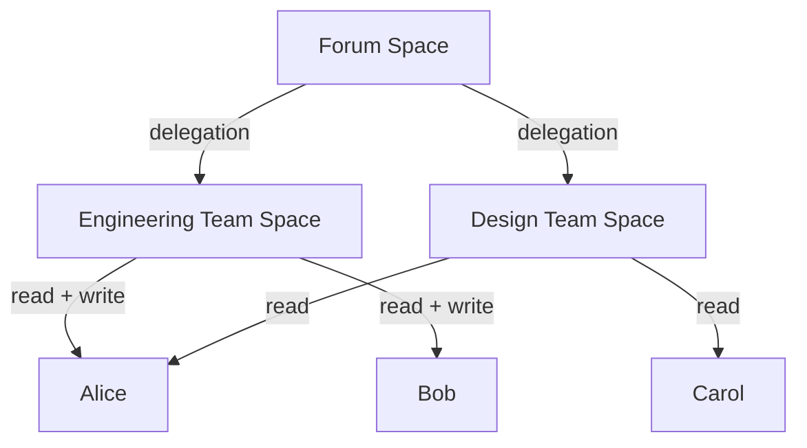

<Callout type="error" title="Experimental">
This API is experimental and will change. See the [Permissioned Spaces overview](../spaces.md) for context.
</Callout>

The member list records who can read and write within a space. Each member has two independent flags:

- **`read`**: the member can read the space's records, and can obtain [space credentials](./credentials.md) under a member-list read policy.
- **`write`**: the member can write records into the space, and is admitted as a writer under a member-list write policy.

A member can hold either flag, both, or neither. The space's [policies](./managing-spaces.md#policies) decide whether the member list is consulted at all.

Only the space's creator or a HappyView super admin can change the member list.

## Setting a member

`com.atproto.simplespace.putMember` adds a member, or replaces the flags of an existing member. Both flags are required, so a call never grants or withdraws access by default.

```ts tab="TypeScript" tab-group="language"
const response = await fetch("https://happyview.example.com/xrpc/com.atproto.simplespace.putMember", {
  method: "POST",
  headers: {
    "X-Client-Key": CLIENT_KEY,
    "Authorization": `DPoP ${ACCESS_TOKEN}`,
    "DPoP": DPOP_PROOF,
    "Content-Type": "application/json",
  },
  body: JSON.stringify({
    space: "at://did:web:happyview.example.com/space/com.example.forum/main",
    did: "did:plc:newmember",
    read: true,
    write: true,
  }),
});
interface Member {
  id: string;
  space_id: string;
  did: string;
  access: { read: boolean; write: boolean };
  is_delegation: boolean;
  granted_by: string | null;
  created_at: string;
}
const data: { member: Member } = await response.json();
```
```js tab="JavaScript" tab-group="language"
const response = await fetch("https://happyview.example.com/xrpc/com.atproto.simplespace.putMember", {
  method: "POST",
  headers: {
    "X-Client-Key": CLIENT_KEY,
    "Authorization": `DPoP ${ACCESS_TOKEN}`,
    "DPoP": DPOP_PROOF,
    "Content-Type": "application/json",
  },
  body: JSON.stringify({
    space: "at://did:web:happyview.example.com/space/com.example.forum/main",
    did: "did:plc:newmember",
    read: true,
    write: true,
  }),
});
const data = await response.json();
```
```rust tab="Rust" tab-group="language"
let response = client
    .post("https://happyview.example.com/xrpc/com.atproto.simplespace.putMember")
    .header("X-Client-Key", client_key)
    .header("Authorization", format!("DPoP {}", access_token))
    .header("DPoP", &dpop_proof)
    .json(&serde_json::json!({
        "space": "at://did:web:happyview.example.com/space/com.example.forum/main",
        "did": "did:plc:newmember",
        "read": true,
        "write": true
    }))
    .send()
    .await?;
let data: serde_json::Value = response.json().await?;
```
```go tab="Go" tab-group="language"
body := bytes.NewBufferString(`{
  "space": "at://did:web:happyview.example.com/space/com.example.forum/main",
  "did": "did:plc:newmember",
  "read": true,
  "write": true
}`)
req, _ := http.NewRequest("POST",
  "https://happyview.example.com/xrpc/com.atproto.simplespace.putMember", body)
req.Header.Set("X-Client-Key", clientKey)
req.Header.Set("Authorization", "DPoP "+accessToken)
req.Header.Set("DPoP", dpopProof)
req.Header.Set("Content-Type", "application/json")
resp, err := http.DefaultClient.Do(req)
```
```sh tab="cURL" tab-group="language"
curl -X POST 'https://happyview.example.com/xrpc/com.atproto.simplespace.putMember' \
  -H 'X-Client-Key: hvc_...' \
  -H 'Authorization: DPoP <token>' \
  -H 'DPoP: <proof>' \
  -H 'Content-Type: application/json' \
  -d '{
    "space": "at://did:web:happyview.example.com/space/com.example.forum/main",
    "did": "did:plc:newmember",
    "read": true,
    "write": true
  }'
```

**Input:**

| Field | Type | Required | Default | Description |
|---|---|---|---|---|
| `space` | string | Yes | | The space URI |
| `did` | string | Yes | | DID of the member, or a space URI for delegation |
| `read` | boolean | Yes | | Whether the member can read the space |
| `write` | boolean | Yes | | Whether the member can write to the space |
| `isDelegation` | boolean | No | `false` | Whether this member is a delegated space (HappyView extension) |

**Response (201):**

```json
{
  "member": {
    "id": "0b7f6a52-4f0e-4d1e-9f3c-2a8f1e6d9c41",
    "space_id": "5d1c8e0a-7b2f-4c39-8e61-3f4a9b2d7e10",
    "did": "did:plc:newmember",
    "access": { "read": true, "write": true },
    "is_delegation": false,
    "granted_by": "did:plc:creator123",
    "created_at": "2026-09-30T12:00:00Z"
  }
}
```

Setting `read` to `false` revokes the member's outstanding space credentials. See [Revocation](./credentials.md#revocation).

Members limited to reading their own records keep that limit when `putMember` updates them. The limit is set with the `read_self` access word, through [legacy addMember](#legacy-addmember) or the [`happyview.spaces` library](../../api-reference/lua/libraries.md).

## Removing a member

Removing a member also revokes their outstanding space credentials. Removing a DID that is not a member fails with `404`.

```ts tab="TypeScript" tab-group="language"
const response = await fetch("https://happyview.example.com/xrpc/com.atproto.simplespace.removeMember", {
  method: "POST",
  headers: {
    "X-Client-Key": CLIENT_KEY,
    "Authorization": `DPoP ${ACCESS_TOKEN}`,
    "DPoP": DPOP_PROOF,
    "Content-Type": "application/json",
  },
  body: JSON.stringify({
    space: "at://did:web:happyview.example.com/space/com.example.forum/main",
    did: "did:plc:newmember",
  }),
});
```
```js tab="JavaScript" tab-group="language"
const response = await fetch("https://happyview.example.com/xrpc/com.atproto.simplespace.removeMember", {
  method: "POST",
  headers: {
    "X-Client-Key": CLIENT_KEY,
    "Authorization": `DPoP ${ACCESS_TOKEN}`,
    "DPoP": DPOP_PROOF,
    "Content-Type": "application/json",
  },
  body: JSON.stringify({
    space: "at://did:web:happyview.example.com/space/com.example.forum/main",
    did: "did:plc:newmember",
  }),
});
```
```rust tab="Rust" tab-group="language"
let response = client
    .post("https://happyview.example.com/xrpc/com.atproto.simplespace.removeMember")
    .header("X-Client-Key", client_key)
    .header("Authorization", format!("DPoP {}", access_token))
    .header("DPoP", &dpop_proof)
    .json(&serde_json::json!({
        "space": "at://did:web:happyview.example.com/space/com.example.forum/main",
        "did": "did:plc:newmember"
    }))
    .send()
    .await?;
```
```go tab="Go" tab-group="language"
body := bytes.NewBufferString(`{
  "space": "at://did:web:happyview.example.com/space/com.example.forum/main",
  "did": "did:plc:newmember"
}`)
req, _ := http.NewRequest("POST",
  "https://happyview.example.com/xrpc/com.atproto.simplespace.removeMember", body)
req.Header.Set("X-Client-Key", clientKey)
req.Header.Set("Authorization", "DPoP "+accessToken)
req.Header.Set("DPoP", dpopProof)
req.Header.Set("Content-Type", "application/json")
resp, err := http.DefaultClient.Do(req)
```
```sh tab="cURL" tab-group="language"
curl -X POST 'https://happyview.example.com/xrpc/com.atproto.simplespace.removeMember' \
  -H 'X-Client-Key: hvc_...' \
  -H 'Authorization: DPoP <token>' \
  -H 'DPoP: <proof>' \
  -H 'Content-Type: application/json' \
  -d '{
    "space": "at://did:web:happyview.example.com/space/com.example.forum/main",
    "did": "did:plc:newmember"
  }'
```

**Response (200):**

```json
{
  "success": true
}
```

## Listing members

```ts tab="TypeScript" tab-group="language"
const response = await fetch(
  "https://happyview.example.com/xrpc/com.atproto.simplespace.listMembers?space=at://did:web:happyview.example.com/space/com.example.forum/main",
  {
    headers: {
      "X-Client-Key": CLIENT_KEY,
      "Authorization": `DPoP ${ACCESS_TOKEN}`,
      "DPoP": DPOP_PROOF,
    },
  },
);
interface ResolvedMember {
  did: string;
  read: boolean;
  write: boolean;
}
const data: { members: ResolvedMember[] } = await response.json();
```
```js tab="JavaScript" tab-group="language"
const response = await fetch(
  "https://happyview.example.com/xrpc/com.atproto.simplespace.listMembers?space=at://did:web:happyview.example.com/space/com.example.forum/main",
  {
    headers: {
      "X-Client-Key": CLIENT_KEY,
      "Authorization": `DPoP ${ACCESS_TOKEN}`,
      "DPoP": DPOP_PROOF,
    },
  },
);
const data = await response.json();
```
```rust tab="Rust" tab-group="language"
let response = client
    .get("https://happyview.example.com/xrpc/com.atproto.simplespace.listMembers")
    .query(&[("space", "at://did:web:happyview.example.com/space/com.example.forum/main")])
    .header("X-Client-Key", client_key)
    .header("Authorization", format!("DPoP {}", access_token))
    .header("DPoP", &dpop_proof)
    .send()
    .await?;
let data: serde_json::Value = response.json().await?;
```
```go tab="Go" tab-group="language"
req, _ := http.NewRequest("GET",
  "https://happyview.example.com/xrpc/com.atproto.simplespace.listMembers?space=at://did:web:happyview.example.com/space/com.example.forum/main",
  nil)
req.Header.Set("X-Client-Key", clientKey)
req.Header.Set("Authorization", "DPoP "+accessToken)
req.Header.Set("DPoP", dpopProof)
resp, err := http.DefaultClient.Do(req)
```
```sh tab="cURL" tab-group="language"
curl 'https://happyview.example.com/xrpc/com.atproto.simplespace.listMembers?space=at://did:web:happyview.example.com/space/com.example.forum/main' \
  -H 'X-Client-Key: hvc_...' \
  -H 'Authorization: DPoP <token>' \
  -H 'DPoP: <proof>'
```

Only the space's creator or a HappyView super admin can list its members. Other accounts receive `403 Forbidden` and unauthenticated callers `401 Unauthorized`, whatever the space's `membership_public` setting.

The response returns the **resolved** member list, with delegation chains traversed and flattened:

```json
{
  "members": [
    { "did": "did:plc:creator123", "read": true, "write": true },
    { "did": "did:plc:delegated-user", "read": true, "write": false },
    { "did": "did:plc:newmember", "read": true, "write": true }
  ]
}
```

## Delegation

A space can be added as a member of another space by setting `isDelegation: true` and passing the delegated space's URI as `did`. The delegated space's members become members of this space, with the flags they hold in the delegated space.

```ts tab="TypeScript" tab-group="language"
const response = await fetch("https://happyview.example.com/xrpc/com.atproto.simplespace.putMember", {
  method: "POST",
  headers: {
    "X-Client-Key": CLIENT_KEY,
    "Authorization": `DPoP ${ACCESS_TOKEN}`,
    "DPoP": DPOP_PROOF,
    "Content-Type": "application/json",
  },
  body: JSON.stringify({
    space: "at://did:web:happyview.example.com/space/com.example.forum/main",
    did: "at://did:web:happyview.example.com/space/com.example.team/engineering",
    read: true,
    write: false,
    isDelegation: true,
  }),
});
```
```js tab="JavaScript" tab-group="language"
const response = await fetch("https://happyview.example.com/xrpc/com.atproto.simplespace.putMember", {
  method: "POST",
  headers: {
    "X-Client-Key": CLIENT_KEY,
    "Authorization": `DPoP ${ACCESS_TOKEN}`,
    "DPoP": DPOP_PROOF,
    "Content-Type": "application/json",
  },
  body: JSON.stringify({
    space: "at://did:web:happyview.example.com/space/com.example.forum/main",
    did: "at://did:web:happyview.example.com/space/com.example.team/engineering",
    read: true,
    write: false,
    isDelegation: true,
  }),
});
```
```rust tab="Rust" tab-group="language"
let response = client
    .post("https://happyview.example.com/xrpc/com.atproto.simplespace.putMember")
    .header("X-Client-Key", client_key)
    .header("Authorization", format!("DPoP {}", access_token))
    .header("DPoP", &dpop_proof)
    .json(&serde_json::json!({
        "space": "at://did:web:happyview.example.com/space/com.example.forum/main",
        "did": "at://did:web:happyview.example.com/space/com.example.team/engineering",
        "read": true,
        "write": false,
        "isDelegation": true
    }))
    .send()
    .await?;
```
```go tab="Go" tab-group="language"
body := bytes.NewBufferString(`{
  "space": "at://did:web:happyview.example.com/space/com.example.forum/main",
  "did": "at://did:web:happyview.example.com/space/com.example.team/engineering",
  "read": true,
  "write": false,
  "isDelegation": true
}`)
req, _ := http.NewRequest("POST",
  "https://happyview.example.com/xrpc/com.atproto.simplespace.putMember", body)
req.Header.Set("X-Client-Key", clientKey)
req.Header.Set("Authorization", "DPoP "+accessToken)
req.Header.Set("DPoP", dpopProof)
req.Header.Set("Content-Type", "application/json")
resp, err := http.DefaultClient.Do(req)
```
```sh tab="cURL" tab-group="language"
curl -X POST 'https://happyview.example.com/xrpc/com.atproto.simplespace.putMember' \
  -H 'X-Client-Key: hvc_...' \
  -H 'Authorization: DPoP <token>' \
  -H 'DPoP: <proof>' \
  -H 'Content-Type: application/json' \
  -d '{
    "space": "at://did:web:happyview.example.com/space/com.example.forum/main",
    "did": "at://did:web:happyview.example.com/space/com.example.team/engineering",
    "read": true,
    "write": false,
    "isDelegation": true
  }'
```

Delegation chains are resolved up to 10 levels deep. When a user appears in several chains, each flag is combined separately: the user can read if any path grants `read`, and can write if any path grants `write`.

### Example: nested teams



In this example, the forum's resolved member list contains:

- Alice with `read` and `write` (write from Engineering)
- Bob with `read` and `write` (via Engineering)
- Carol with `read` (via Design)

## Legacy addMember

`com.atproto.simplespace.addMember` and `dev.happyview.space.addMember` are deprecated and kept until v3. They take a single `access` word in place of the two flags:

| `access` | Equivalent |
|---|---|
| `write` | `read: true, write: true` |
| `read` (default) | `read: true, write: false` |
| `read_self` | Reads limited to the member's own records |
| `none` | `read: false, write: false` |

`addMember` fails with `409 Conflict` when the DID is already a member. Use `putMember` to change an existing member.
